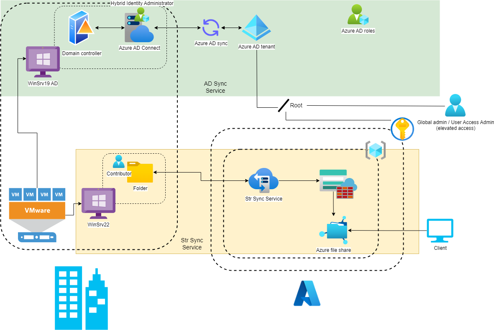

# AD Sync and File Sync Services
## Lession learn
- How to set up AD Connect from on-premises to Azure cloud
- How to manage synchronization process from on-premises
- Sync manually, change interval
- Setup Azure file sync service

## Architecture 

  

This is the lab to demo the AD Sync and Storage Sync Services and some essential setting when using both of them. The Azure infrastructure in this lab was built by Terraform 

## AD Sync Service
See more in the [Azure Document](https://learn.microsoft.com/en-us/azure/active-directory/hybrid/connect/how-to-connect-install-roadmap). Some essential notes
- On Cloud:
  - Create a new user with the certain AD Domain to hold all user synced from on-premise
  - Role requirement (RBAC): **Hybrid Identify Administrator or Global Administrator** for AD Connect
- On-Premises
  - The **Active Directory schema version** and **forest functional level** must be Windows Server 2003 or later
  - Install **Azure AD Connect**:
    - Sync - Azure AD sign-in:
      - If you don't have Mail Exchange, you should use *sAMAccountName* as a user principle name. [Here](https://learn.microsoft.com/en-us/azure/active-directory/hybrid/connect/plan-connect-userprincipalname) is for more information
    - Configure
      - Password hash synchronization: synchronizes the password hash in Active Directory to Azure AD *every 30 mins* by default. Using Windows PowerShell to change the default value following this [document](https://learn.microsoft.com/en-us/azure/active-directory/hybrid/connect/how-to-connect-sync-feature-scheduler)
        - <code>Get-ADSyncScheduler</code>: See the current configuration settings
        - <code>Set-ADSyncScheduler -CustomizedSyncSCycleInterval 0:0:30</code>: Change the default sync interval (the minimum number is 30 minutes)
      - Password writeback: Allow users to change and reset their passwords in the cloud and on-premises password policy applied (the new passwords will be applied to on-premises immediately)
  - **Synchronization Service Manager** will be installed with Azure AD Connect to *manage the synchronization*, admin can keep track of some change from this tool.
  - Using **Windows PowerShell** to *update user directly* without waiting for the interval
    - <code>Import-Module ADSync</code>: Import the ADSync module used for managing and synchronizing user accounts between on-premises Active Directory and Azure Active Directory (AAD) in a hybrid environment
    - <code>Start-ADSyncSyncCycle -PolicyType Delta</code>: To manually synchronize *only the changes* that have occurred since the last synchronization. This use for an urget change because the time requirement
    - <code>Start-ADSyncSyncCycle -PolicyType Initial</code>: To initiate a *full sync cycle*, Running a full sync cycle can be very time consuming
  

    
  

## File Sync Service
- On Cloud:
  - Role requirement (IAM): Subcription or Resource Group *contributor role* to allow writing file to file share
  - The *replication type* in storage account created by Terraform have to be GRS to be set as a cloud endpoint when configurating sync service group
- On-Premises:
  - Install *StorageSyncAgent*, click [here](https://learn.microsoft.com/en-us/azure/storage/file-sync/file-sync-server-registration) for more detail
  - Login with the assigned user above
- Azure File Sync Server endpoint:
  - Cloud Tiering:
    - Volume Free Space: The amount of *free space* to reserve on the volume on which the server endpoint is located
    - Data Policy: These files haven't been accessed for the specified *number of days*
  - Initial Upload:
    - Option 1: *Merge* the content of this server path with the content in the Azure file share
    - Option 2: Authoritatively *overwrite* files and folders in the Azure file share
  - Initial Download:
    - Option 1: Download the *namespace* first and then recall the file *content*, as much as will *fit on the local disk*
    - Option 2: Download the *namespace* only. The file content will be recalled when accessed.
    - Option 3: Avoid tiered files. Files will only appear on the server once they're *fully downloaded*.

  

      
  

## Elevate access to manage all Azure subsciptions
A Global Administrator in Azure Active Directory (Azure AD), you *might not have access to all subscriptions* and management groups in your directory\
Azure AD and Azure resources are *secured independently* from one another. However, if you are a *Global Administrator* in Azure AD, you can *assign yourself* access to all Azure subscriptions and management groups in your directory\
For more information, click [here](https://learn.microsoft.com/en-us/azure/role-based-access-control/elevate-access-global-admin)