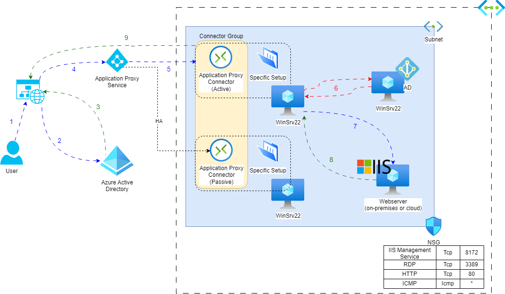

# Application Proxy
## Lession learn
- Setup Application Proxy Service and understand their authentication
- Setup some Windows' services such as IIS (Internet Information Services), Domain Server and configure VM to be as a Azure Application Proxy
## Architecture 

  

This is the lab to demo the Azure Application Proxy service and some essential setting when using both of them. The Azure infrastructure in this lab was built by **Terraform**

## Data Flow
For more information, click [here](https://learn.microsoft.com/en-us/azure/active-directory/app-proxy/application-proxy).
1. User has accessed the application through their browser
2. The user is directed to the Azure AD sign-in page.
3. After a successful sign-in, Azure AD sends a token to the user's client device
4. The client sends the token to the Application Proxy service, which *retrieves the user principal name (UPN) and security principal name (SPN)* from the token
5. Application Proxy then sends the request to the Application Proxy connector
6. If you have configured Single sign-on, the connector performs any additional authentication required on behalf of the user
7. The connector sends the request to the application
8. The response is sent through the connector and Application Proxy service to the user

## Setup some Windows Machines:
1.  Setup Webserver
- Install **IIS service** on Windows machine
- Build **a simple webapp** by add *Default.html* file containing <code>`<h1>`This is an Azure web of Thinh Phung`</h1>`</code> in *C:\inetpub\wwwroot*. Testing this app follows the URL: `http://localhost/Default.html`
2. Building the internal Domain server
- Install **Active Directory Domain Services** on Windowns machine
- Add Domain server internal IP address to **DNS servers** in VNet to let all VMs in this Vnet can resolve this Domain name
3. Azure AD Applicaion Proxy connectors
- Create a new user which roles **Application Administrator** to add the Connector
- **Public IP address** is obligatory
- Configure [**TLS requirements**](https://learn.microsoft.com/en-us/azure/active-directory/app-proxy/application-proxy-add-on-premises-application)
- Download **Connector service agent** from Application proxy in Azure Active Directory to this Window, using the created user to register in the Application Proxy
- Turn off Internet Explorer Enhanced Security Configuration
4. Join all windows to AD Domain Services and restart all machine

## Configure on Azure:
- After installing **connector agent**, the machine will be *recogized automatically by Azure* in Application proxy
- **High Availability** will achieve by *adding 2 Application Proxy Connector to a single Connector Group*. This HA is an active-passive mode. When a main Proxy Connector down, the connection group automatically switch to the passive Proxy
- In **Configure an app**, you have some essential setup:
  - Internal Url: It has to be a host name, not IP address -> you have to join this machine to AD Domain or create an internal DNS Server
  - Pre Authentication:
    - Azure Active Directory: Using Domain account to authenticate for login
    - Passthrough: Everyone can login
  - After successful configuration, the app will be **automatically added to Enterprise applications** by the Name set in *Configure an app* (to use Azure Active Directory for authenticate)
- **Single sign-on (SSO)**: You can configure this feature by following [this document](https://learn.microsoft.com/vi-vn/azure/active-directory/app-proxy/application-proxy-config-sso-how-to)
  - You *have to join Win hosting Application Proxy Connector to AD domain*. Click [here](https://learn.microsoft.com/vi-vn/azure/active-directory/app-proxy/application-proxy-configure-single-sign-on-with-kcd) to see how it works
  - After receiving UPN and SPN in step (4), Connector pulls those to AD to process further authentication requirements. Free user to authenticate again
  

  

- In the defaul Azure Active Directory, choose the certain Web in Enterprise applications to
  - Setup configure *SSO and application proxy*, or setup their *permission*
  - Add extra layer of security by setup *Conditional Access*, 

Users can use Domain account to login this link https://myapps.microsoft.com/ for testing, all Enterprise applications will be shown here